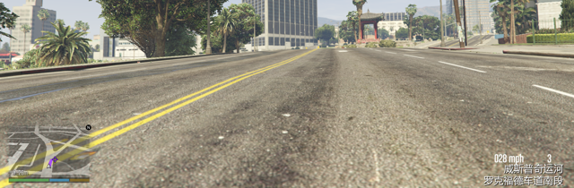
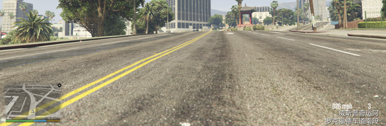
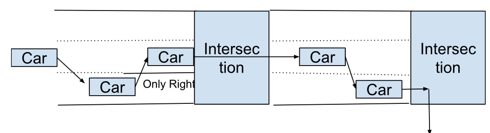
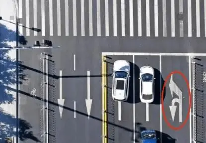
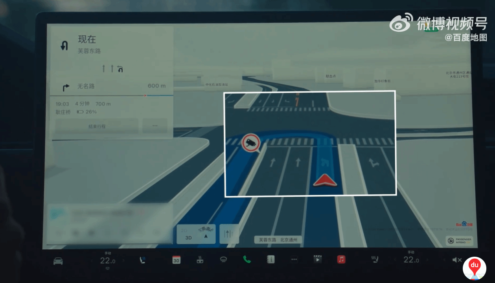

# GTA5 FSD

This is a project which creates a self-driving car in GTA V with Pytorch that follows the ingame minimap. The model takes in a 640x160 RGB image as well as the current speed of the car and outputs the steering angle and the amount of throttle and brake.

# Python Files
* data_recorder.py records screen shots as BMP image and inputs of steering angle, throttle and brake.
* data_seletor.py analyzes the balance of the training data.
* gta_v_driver_model.py is model in Pytorch.
* train.py trains the model and save model after each epoch.
* gta_fsd_driver.py runs the model, makes prediction on each frame and uses vJoy as input.


# Model
The model use 8 convolutional layers and 6 dense layers. The input is the 640x160 RGB image. The output is 3 numbers which are steering angle, throttle and brake.

```
==========================================================================================
Layer (type:depth-idx)                   Output Shape              Param #
==========================================================================================
Net                                      [5, 3]                    --
├─Sequential: 1-1                        [5, 48, 77, 317]          --
│    └─Conv2d: 2-1                       [5, 48, 77, 317]          7,104
│    └─ReLU: 2-2                         [5, 48, 77, 317]          --
├─Sequential: 1-2                        [5, 64, 36, 156]          --
│    └─Conv2d: 2-3                       [5, 64, 71, 311]          150,592
│    └─ReLU: 2-4                         [5, 64, 71, 311]          --
│    └─MaxPool2d: 2-5                    [5, 64, 36, 156]          --
├─Sequential: 1-3                        [5, 96, 32, 152]          --
│    └─Conv2d: 2-6                       [5, 96, 32, 152]          153,696
│    └─ReLU: 2-7                         [5, 96, 32, 152]          --
├─Sequential: 1-4                        [5, 128, 15, 75]          --
│    └─Conv2d: 2-8                       [5, 128, 28, 148]         307,328
│    └─ReLU: 2-9                         [5, 128, 28, 148]         --
│    └─MaxPool2d: 2-10                   [5, 128, 15, 75]          --
├─Sequential: 1-5                        [5, 192, 13, 73]          --
│    └─Conv2d: 2-11                      [5, 192, 13, 73]          221,376
│    └─ReLU: 2-12                        [5, 192, 13, 73]          --
├─Sequential: 1-6                        [5, 256, 6, 36]           --
│    └─Conv2d: 2-13                      [5, 256, 11, 71]          442,624
│    └─ReLU: 2-14                        [5, 256, 11, 71]          --
│    └─MaxPool2d: 2-15                   [5, 256, 6, 36]           --
├─Sequential: 1-7                        [5, 384, 4, 34]           --
│    └─Conv2d: 2-16                      [5, 384, 4, 34]           885,120
│    └─ReLU: 2-17                        [5, 384, 4, 34]           --
├─Sequential: 1-8                        [5, 512, 2, 32]           --
│    └─Conv2d: 2-18                      [5, 512, 2, 32]           1,769,984
│    └─ReLU: 2-19                        [5, 512, 2, 32]           --
├─Flatten: 1-9                           [5, 32768]                --
├─Sequential: 1-10                       [5, 4096]                 --
│    └─Linear: 2-20                      [5, 4096]                 134,225,920
│    └─Dropout: 2-21                     [5, 4096]                 --
├─Sequential: 1-11                       [5, 4096]                 --
│    └─Linear: 2-22                      [5, 4096]                 16,781,312
│    └─Dropout: 2-23                     [5, 4096]                 --
├─Sequential: 1-12                       [5, 3074]                 --
│    └─Linear: 2-24                      [5, 3074]                 12,594,178
│    └─Dropout: 2-25                     [5, 3074]                 --
├─Sequential: 1-13                       [5, 2048]                 --
│    └─Linear: 2-26                      [5, 2048]                 6,297,600
│    └─Dropout: 2-27                     [5, 2048]                 --
├─Sequential: 1-14                       [5, 1024]                 --
│    └─Linear: 2-28                      [5, 1024]                 2,098,176
│    └─Dropout: 2-29                     [5, 1024]                 --
├─Sequential: 1-15                       [5, 3]                    --
│    └─Linear: 2-30                      [5, 3]                    3,075
==========================================================================================
Total params: 175,938,085
Trainable params: 175,938,085
Non-trainable params: 0
Total mult-adds (G): 32.41
==========================================================================================
Input size (MB): 6.14
Forward/backward pass size (MB): 162.55
Params size (MB): 703.75
Estimated Total Size (MB): 872.44
==========================================================================================
```
### Versions used

- Python: 3.10
- Pytorch: 2.41

### Pip Packages

These are the pip packages I extracted from pip freeze...

- mss==9.0.2
- numpy==1.26.4
- opencv-python==4.10.0.84
- Pillow==10.4.0
- pygame==2.6.0
- pypiwin32==3.6
- torch==2.4.1
- torchinfo==1.8
- torchvision==0.19.1
- pyvjoystick==1.1.2.1


# Thoughts about this project

##  Short memory
This project makes prediction frame by frame. Ideally the model should have a short memory or make prediction on last several seconds of sensor data. The problem of making prediction on frame is there is no speed imformation of other cars. 

### Examples
 * My car is following another car at 30 MPH. It will be very easy to know I am following the car in a video. But it would look like I am going to rear end the front car on a single frame because it's impossible to know if the other car is moving or stationary on a single frame. 
 
 * Stop Sign. The model needs to remember which car comes earlier, so the model should have a short memory. In other workds, it makes prediction on last a few seconds of video.

### 3D CNN
3D CNN can process video and seems a good option for making neural network to have good short memory.

## Training data collection and cleaning.

### Conflicting data makes training difficult. 
Conflicting data is the opposite driving behiviors on similar situations.
In my training data, there are some bad quality data.
* I drive wrongly and didn't follow navigation sometimes. Some city roads are difficult and I made mistakes to find the correct road. I pause the recording and delete the image soon after it happen. 
* Driving randomly without navigation can makes training difficult. The navigation can disappear when I reach destination, see the two images below.  I want the car to follow the navigation and stop when reaches destination. So I deleted the image with no navigation on it.





# Thoughts about Tesla FSD

## Rador and Lidar
Rador is used to find the speed of other cars and lidar is for creating 3D model. Other self driving companies have to use those because it's difficult to calcualte speed or build 3D model on vision. Human drives car on vision. Only tesla is able to collect data from real-world driver, e.g., vision data and driving maneuvers.

## Lane level navigation. 
The current FSD doesn't seem to know the lane information from navigation. It makes this mistake on this situation. 


In China, the left turn lane may not be the left lane (can be mid lane). If the self driving car doesn't know whether lane is left turn lane. It could make mistakes.




Current Tesla navigation in China on Left turn lane.


### Road data collection.
Tesla is able to get road information through the collected dashcam video. Or, the car can process the video, generate road information and upload to server.

## Speed limit
Speed limit maybe different at different time. In some cases, school zone speed limit is active during Mo-Fr 7:00-9:00; 14:00-16:00 or when the yellow light is flashing. It's difficult for CNN model to understand. The easy fix is to set the speed limit correctly and let car follow the speed limit.
